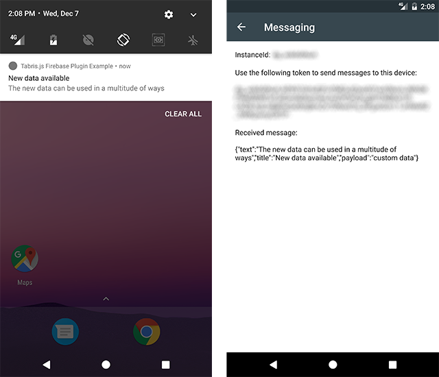

# Tabris.js Firebase Plugin

The `tabris-plugin-firebase` plugin project provides a [Tabris.js](https://tabrisjs.com) API receive [firebase cloud messages](https://firebase.google.com/docs/cloud-messaging/). The plugin currently supports Android only with iOS support in the works.



## Example

The following snippet shows how the `tabris-plugin-firebase` plugin can be used to receive a cloud message in an Tabris.js app.

```js
console.log('Token to send to server: ' + firebase.Messaging.token);

firebase.Messaging.on('tokenRefresh', function(messaging, token) {
  console.log('New token to use on the server: ' + token);
});

firebase.Messaging.on('message', function(messaging, data) {
  console.log('Received message: ' + JSON.stringify(data));
});
```

A more elaborate example can be found in the [example](example/) folder. It provides a Tabris.js cordova project that demonstrates the various features of the `tabris-plugin-firebase` integration. When building the example project don't forget to run `npm install` inside the `www` folder to fetch the Tabris.js dependencies.

To send a command On the server side a `curl` command could be used to send a `POST` request like:

```shell
curl -X POST -H "Authorization: key=<server-key>" -H "Content-Type: application/json" -d '{
  "to": "<token>", "data": { "title": "New data available", "text": "The new data can be used in a multitude of ways", "payload": "custom data" }}' "https://fcm.googleapis.com/fcm/send"
```

## Integrating the plugin
Using the plugin follows the standard cordova plugin mechanism. The Tabris.js website provides detailed information on how to [integrate custom widgets](https://tabrisjs.com/documentation/latest/build#adding-plugins) in your Tabris.js based app.

### Add the plugin to your project

The plugin can be added like any other cordova plugin. Either via the `cordova plugin add` command or as an entry in the apps `config.xml` (recommended):

```xml
<plugin name="tabris-plugin-firebase" spec="1.0.0" />
```

To fetch the latest development version use the GitHub url:

```xml
<plugin name="tabris-plugin-firebase" spec="https://github.com/eclipsesource/tabris-plugin-firebase.git" />
```

#### Notification icon

A notification icon can be provided via the plugin variable `ANDROID_NOTIFICATION_ICON`. The icon has to be the name of a regular Android drawable inside the Androids `res` folder. A build hook should be used to copy the image from your project into the `android` platform. See the [example project](example/) for an outline of the approach.

The icon can be configured inside your apps `config.xml`:

```xml
<plugin name="tabris-plugin-firebase" spec="1.0.0">
  <variable name="ANDROID_NOTIFICATION_ICON" value="drawable_name" />
</plugin>
```

Alternatively the image can be added during the `cordova plugin add` command:

```bash
cordova plugin add <path-to-tabris-firebase-plugin> --variable ANDROID_NOTIFICATION_ICON=`drawable_image`
```

## Sending message with notifications

When the server sends a message to a device it can create two types of messages: "notification" messages and "data" messages. Messages that contain a `notification` property are treated as "notification" message. More details of the differences between "notification" and "data" messages can be found in the [firebase documentation](https://firebase.google.com/docs/cloud-messaging/concept-options#notifications_and_data_messages).

The key difference for this plugin is that "notification" messages create their notification automatically when the app is in the background. Tapping on the notification does *not* forward the notification data to the app.

To create a notification that also delivers its data to the app a regular "data" notification has to be created. A "data" message is a message that does _not_ have a property `notification`.

To configure the generated notification the following keys are supported:

- `id` : `number`
- `title` : `string`
- `text` : `string`

The following message would create a notification similar to the screenshot above:

```
POST /fcm/send HTTP/1.1
Host: fcm.googleapis.com
Authorization: key=<server-key>
Content-Type: application/json

{
  "to": "<token>",
  "data": {
    "title": "New data available",
    "text": "The new data can be used in a multitude of ways",
    "payload": "custom data"
  }
}
```

Not that the json object does not contain a `notification` property. Using the same `id` for multiple messages updates an existing notification on the device. Omitting the `id` creates a random id on the device so that each message results in a unique notification.

## Compatibility

Compatible with [Tabris.js 2.0.0](https://github.com/eclipsesource/tabris-js/releases/tag/v2.0.0)

## Development of the widget

While not required by the consumer of the widget, this repository provides Android specific development artifacts. These artifacts allow to more easily consume the native source code when developing the native parts of the widget.

### Android

The project provides a gradle based build configuration, which also allows to import the project into Android Studio.

In order to reference the Tabris.js specific APIs, the environment variable `TABRIS_ANDROID_CORDOVA_PLATFORM` has to point to the Tabris.js Android Cordova platform root directory.

```bash
export TABRIS_ANDROID_CORDOVA_PLATFORM=/home/user/tabris-android-cordova
```
 The environment variable is consumed in the gradle projects [build.gradle](plugin/project/android/build.gradle) file.

## Copyright

Published under the terms of the [BSD 3-Clause License](LICENSE).
